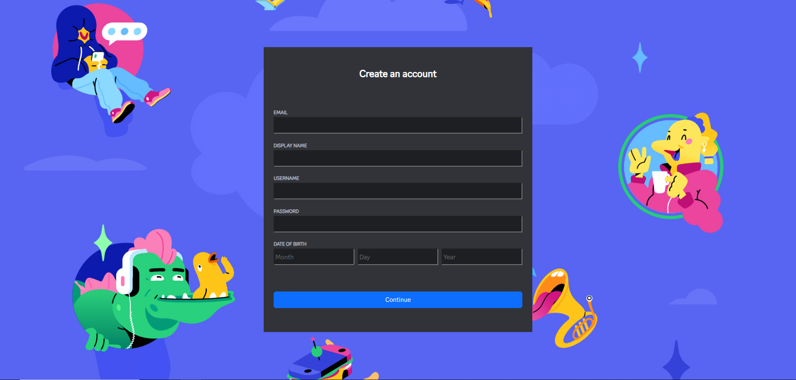
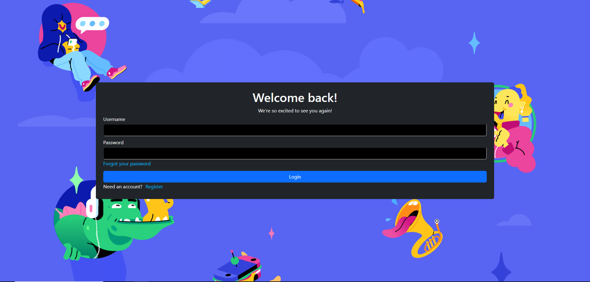
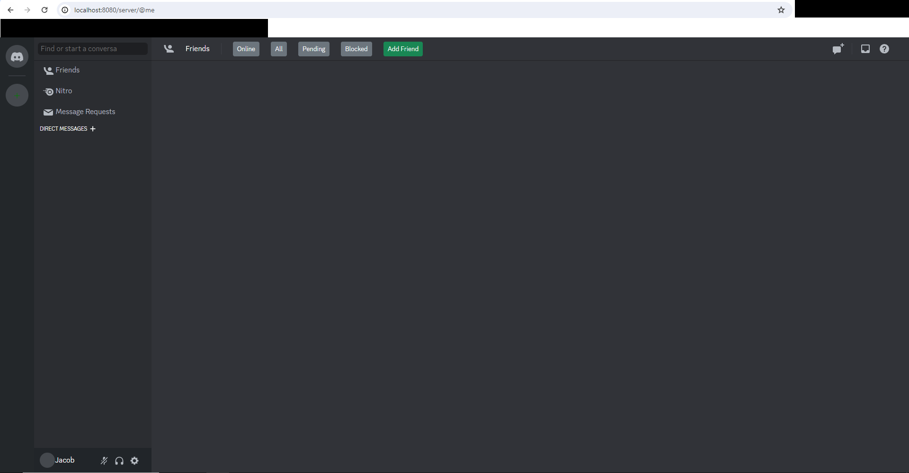
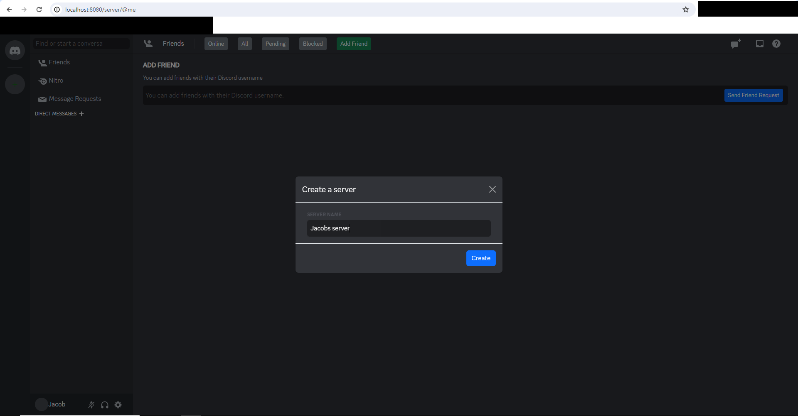
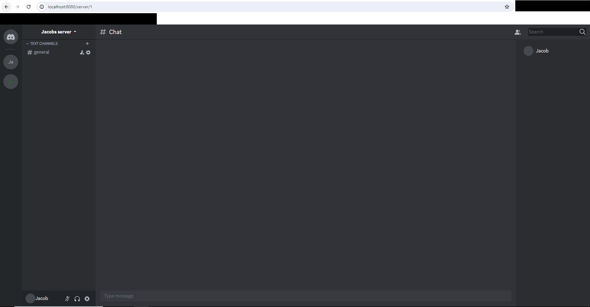

# Discord Clone

This program emulates some of the functionalities of the well known app Discord. This program is purely for my
educational benefit and does not feature every Discord functionality that the **real** Discord has to offer







## How it works?

### The Code

- Spring Boot (Backend)
    - Uses Spring Boot as the backend framework to handle api calls, database logic, and websocket protocol
- Typescript, CSS _(Bootstrap)_, and HTML (Frontend)
    - Typescript is compiled to javascript and is then used to handle the logic for button clicks, websocket
      connections, etc. HTML and CSS used for visual

### Core Functionality

- Creating Servers
- Creating Channels
- Real time communication
- Direct Messaging
- Server Invites
- Adding Friends
- Login and Signup

## How to run the program yourself?

### Docker Compose

- [Install Docker](https://docs.docker.com/get-docker/)
- [Install Typescript Compiler](https://www.typescriptlang.org/download)
    - You will need to compile the typescript to javascript. Intellij IDE comes with a Typescript compiler preinstalled.
      I am unsure on how to compile Typescript without it *(actually I know how, but I am too lazy to explain)* so you
      are on your own for that
- Download and unzip this package to a local directory on your machine
- Open up your terminal and navigate to the unzipped folder of this library
- Type the following in your terminal
    - `docker-compose up`
- Navigate to `http://localhost:8080`
- Click Signup on the top right of your screen to create an account
- Click Login and then login with the username and password entered in Signup
- You now have a very limited version of Discord were you can only talk to yourself. Have fun!
- PS if you want to use the add friend, direct message, invite to server functionalities you need to have two browsers
  open with two different accounts logged in

### Manual Installation

To get started you will first need the following installed on your machine

- [Java JDK-17](https://www.oracle.com/java/technologies/downloads/#java17)
- [MySQL Server 8.*.\*](https://dev.mysql.com/downloads/mysql/) I use 8.0.36
- [Install Typescript Compiler](https://www.typescriptlang.org/download)
    - You will need to compile the typescript to javascript. Intellij IDE comes with a Typescript compiler preinstalled.
      I am unsure on how to compile Typescript without it *(actually I know how, but I am too lazy to explain)* so you
      are on your own for that
- Download and unzip this package to a local directory on your machine
- In `src/main/resources/application.properties` change the
  ```
  spring.datasource.url=jdbc:mysql://${MYSQL_HOST:localhost}:3306/db_example
  spring.datasource.username=springuser
  spring.datasource.password=ThePassword
  ```
  to your MySQL environment variables (or set it up the same way I have it set up here)
- Open your terminal and navigate to the discord_clone project directory and run the following
  command `./mvnw spring-boot:run`
- Navigate to `http://localhost:8080`
- Click Signup on the top right of your screen to create an account
- Click Login and then login with the username and password entered in Signup
- You now have a very limited version of Discord were you can only talk to yourself. Have fun!
- PS if you want to use the add friend, direct message, invite to server functionalities you need to have two browsers
  open with two different accounts logged in